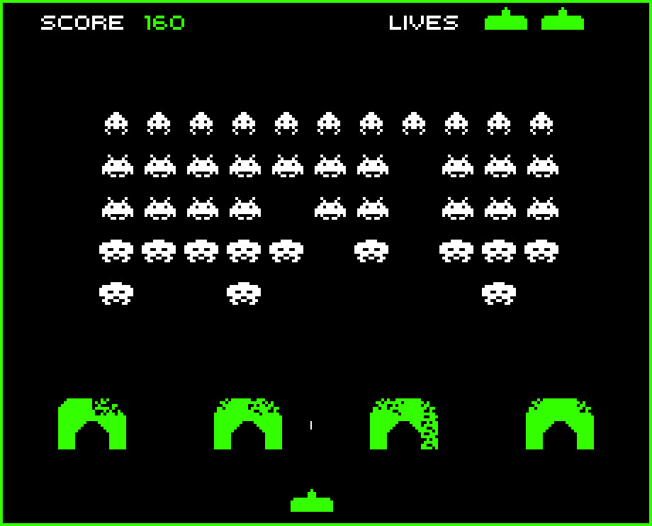

# Radar for SpaceInvaders



## How to use it
1- Generate Jar file
```bash
mvn clean package
```
2- Execute project with parameters
```bash
java -jar target/invaders-0.0.1-SNAPSHOT.jar 85 /home/samuel/workspaces/invaders/src/main/resources/radar.txt```
```
### Purpose
This program finds in a dirty radar image some aliens that want to invade us :)
Some known enemies are

#### Evil Crab

--o-----o--
---o---o---
--ooooooo--
-oo-ooo-oo-
ooooooooooo
o-ooooooo-o
o-o-----o-o
---oo-oo---


#### Flying Squid

---oo---
--oooo--
-oooooo-
oo-oo-oo
oooooooo
--o--o--
-o-oo-o-
o-o--o-o

